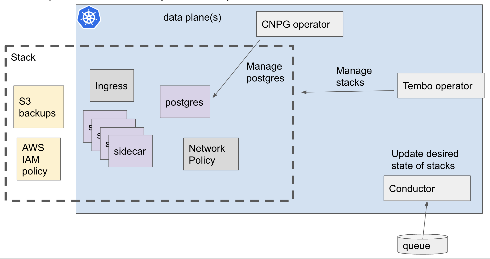

# Data Plane

Dataplanes are where Postgres runs.

## Conductor

Dataplanes receive the desired state of databases from the control plane. The dataplanes report back the actual status of database to the control plane.

The conductor is responsible for:
- Dequeuing desired state from control plane, and applying into Kubernetes
- Enqueuing back to the control plane the actual state of resources

## Tembo operator

The operator is responsible for managing Stacks. The operator depends on [Cloud Native PG](https://cloudnative-pg.io/) for managing postgres. The operator adds additional features such as extension management.

### Tembo pod init

This worklow is a Kubernetes mutating webhook and is a subcomponent of the operator.

## Dataplane webserver

The dataplane webserver is an API that runs for each dataplane. Some features of the platform are best served from the dataplane instead of from the control plane in order to avoid centralizing data. For example metrics. The dataplane API is authenticated against the control plane.
