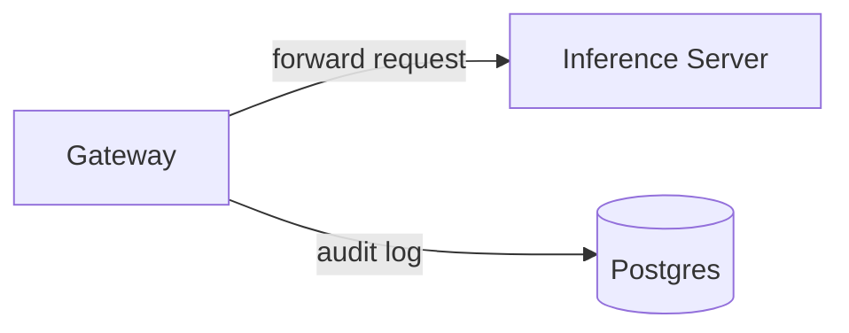

# :construction: Tembo Inference Server :construction:

This is a LLM hosting service for the Tembo Platform. It is built on top of [vLLM](https://github.com/vllm-project/vllm), and provides additional functionality for audit logging to enable tracking usage metrics hosted models.

## Architecture

- `Gateway` : an HTTP webserver that forwards requests to the inference server, and logs organization id, model id, and token counts to a Postgres database.
- `Inference Server`: a vLLM model server that hosts various LLMs
- `Postgres`: a standard Postgres database




## Development

Run Postgres and the Inference Service on CPU:

```bash
docker compose up postgres vllm-cpu -d
```

Run the Gateway:

```bash
make run
```

Send an example request to the gateway

```bash
curl -X POST http://localhost:8080/v1/chat/completions \
    -H "X-TEMBO-ORG: MY-TEST-ORG" \
    -H "X-TEMBO-INSTANCE: MY-TEST-INSTANCE" \
    -H "Content-type: application/json" \
    -d '{
        "model":  "facebook/opt-125m",
        "messages": [{"role": "user", "content": "San Francisco is a..."}]}'
```

## Testing

Set up Postgres and Migrations.

```bash
make run-postgres
make run-migrations
```

Unit tests:

```bash
make unit-test
```

Integration tests:

```bash
make integration-test
```
