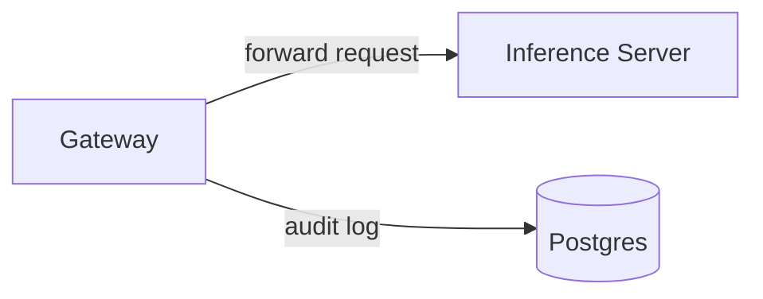

# :construction: Tembo Inference Server :construction:

This is a LLM hosting service for the Tembo Platform. It is built on top of [vLLM](https://github.com/vllm-project/vllm), and provides additional functionality for audit logging to enable tracking usage metrics hosted models.

## Architecture

- `Gateway` : an HTTP webserver that forwards requests to the inference server, and logs organization id, model id, and token counts to a Postgres database.
- `Inference Server`: a vLLM model server that hosts various LLMs
- `Postgres`: a standard Postgres database

